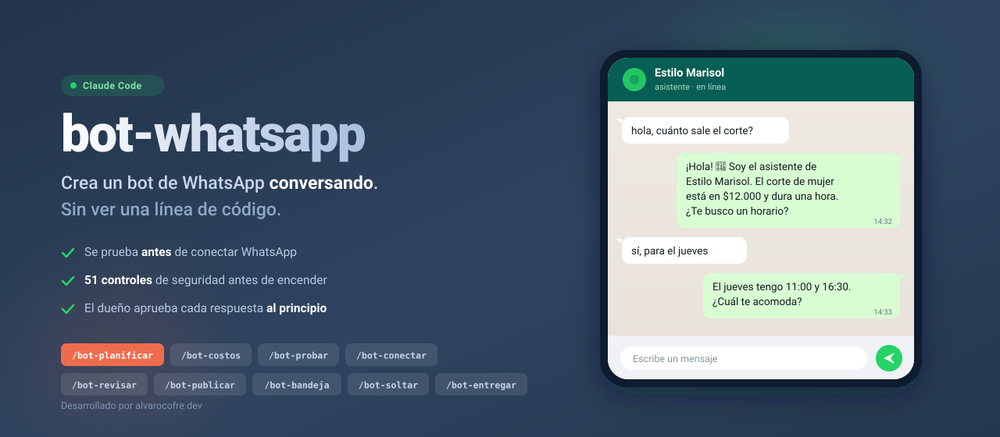

<p align="center">
  
</p>

<p align="center">
  
  
  
  
</p>

# Bot de WhatsApp — Sistema de comandos

Sistema de skills para Claude Code que crea, prueba y pone en producción un bot de WhatsApp con
IA, **conversando en lenguaje de negocio con el dueño** — sin mostrarle una línea de código.

No genera código a ciegas: acompaña. El dueño toma las decisiones de negocio, el agente hace todo
lo técnico en silencio, y cada etapa se cierra con algo que él comprueba con sus propios ojos.

---

## ⚠️ Para quién es esto — léelo antes de nada

**Lo usa quien tiene Claude Code instalado.** Es decir: **tú**, sentado con el dueño del negocio
al lado, o compartiendo pantalla con él.

**No es** algo que le mandes a la dueña de una peluquería para que lo instale sola. El sistema
está escrito con un cuidado obsesivo para que ella no vea jerga técnica **desde el minuto 1** —
pero el minuto 0 (instalar Claude Code, copiar carpetas) es tuyo, no de ella.

Las dos formas correctas de usarlo:

| Modo | Cómo funciona |
|---|---|
| **Con el dueño al lado** | Tú manejas el teclado, él responde las preguntas y prueba desde su celular. El recomendado. |
| **Tú como intermediario** | Tú corres el proceso y le llevas las preguntas al dueño por WhatsApp o teléfono. Funciona, pero se pierde la mitad de la gracia: él no ve su bot funcionando en vivo. |

Si el dueño **sí** es técnico y quiere correrlo solo, funciona igual — el sistema no asume que
sabe nada.

---

## Qué lo diferencia

**Se prueba antes de conectar.** El usuario ve su asistente funcionando en un simulador que se ve
como WhatsApp —y lo rompe a propósito con 14 pruebas— **antes** de meterse en el trámite con Meta.
Conectar el número es lento, depende de terceros y un error quema el número para siempre: nadie
debería pasar por eso sin saber todavía si el bot le sirve.

**Cero código a la vista.** El usuario nunca abre una terminal, nunca edita un archivo, nunca ve
un mensaje de error. Sus únicas acciones son abrir un link, hacer clic, copiar algo, responder una
pregunta o escribir un comando.

**Interrumpible por diseño.** Cada etapa es un comando propio y el estado vive en un archivo, así
que se puede parar el martes y retomar el jueves sin repetir nada.

**Sin cronómetros a la vista.** El sistema nunca le anuncia al dueño cuánto va a demorar una etapa
ni el proceso completo. Un número grande al principio hace que lo deje para después y no vuelva —
y como el tiempo real depende de cuánto tenga que contar, cualquier cifra sería inventada. Lo que
sí se le dice es que puede parar cuando quiera y que nada se pierde.

**Se suelta con métricas, no con corazonadas.** El bot pasa a responder solo cuando cumple 5
métricas medibles, y se suelta por partes: primero responder en horario, después fuera de horario,
al final agendar.

**Costos honestos.** Nada se declara "gratis" sin mostrar antes la tabla real y el punto exacto
donde deja de serlo — incluido el cambio de Meta del 1 de octubre de 2026, donde cada respuesta
del bot pasa a costar.

---

## Instalación

Copia cada carpeta a tus skills de Claude Code:

```bash
cp -r bot-* ~/.claude/skills/
```

Después se invoca con `/bot-whatsapp` — ese comando orienta y despacha al resto.

---

## Los 9 comandos

| Comando | Qué hace |
|---|---|
| `/bot-whatsapp` | Punto de entrada: orienta, detecta dónde vas y despacha |
| `/bot-planificar` | Seguridad, 13 preguntas del negocio, y el guion |
| `/bot-costos` | Qué cuentas necesita y cuánto cuesta de verdad |
| `/bot-probar` | Construye el asistente y lo prueba **en demo** |
| `/bot-conectar` | Conecta el número real. El paso más frágil |
| `/bot-revisar` | La compuerta de seguridad: 51 ítems |
| `/bot-publicar` | Enciende con clientes reales, en modo borrador |
| `/bot-bandeja` | Operación diaria: aprobar respuestas |
| `/bot-soltar` | Pasarlo a automático, por partes y con métricas |
| `/bot-entregar` | Si es para un cliente: manual, precios, contrato |

---

## Estructura

```
bot-whatsapp/                     Punto de entrada + todas las referencias
  SKILL.md
  references/
    reglas.md                     Las 9 reglas de oro (todos los comandos la cargan)
    estado.md                     Cómo se lleva ESTADO.md y se retoma
    seguridad.md                  Brief de riesgos + 51 ítems de blindaje
    descubrimiento.md             Las 13 preguntas → Ficha del Bot
    conversacion.md               Tono, guion, escalamiento, ejemplos
    herramientas-costos.md        Stack y la tabla de costos real
    construccion.md               Guía técnica: arquitectura, Zernio, trampas de su API
    verificacion.md               La auditoría ejecutable y los 3 tests innegociables
    demo.md                       El simulador y qué se puede probar sin WhatsApp
    conexion-whatsapp.md          Conectar el número, clic por clic
    pruebas.md                    Las 14 pruebas
    produccion.md                 El encendido y la revisión del día 7
    bandeja.md                    Operación diaria y soltado con métricas
    entrega-cliente.md            Manual, precios, soporte, contrato
    legal.md                      Meta, Anthropic y datos personales (universal)
    legal-chile.md                Anexo de Chile (solo si el negocio es chileno)

bot-planificar/    bot-costos/     bot-probar/     bot-conectar/
bot-revisar/       bot-publicar/   bot-bandeja/    bot-soltar/     bot-entregar/
```

Cada comando es un `SKILL.md` corto que carga las referencias compartidas. Las referencias viven
en un solo lugar: no hay contenido duplicado entre comandos.

---

## El estado

Un archivo `ESTADO.md` en la carpeta del proyecto guarda la Ficha del Bot, en qué etapa va, qué se
decidió, qué riesgos aceptó el usuario y qué quedó pendiente. Todos los comandos lo leen al
empezar y lo actualizan al cerrar.

Es lo que permite retomar sin repetir.

---

## Dos cosas por verificar antes de usarlo con un cliente que paga

1. Que el Inbox del proveedor de mensajería funcione en su plan gratuito sin tarjeta — su propia
   documentación se contradice en este punto.
2. La tarifa de mensajes de servicio para Chile en el rate card oficial de Meta, tras el cambio
   del 1 de octubre de 2026.

Ambas están marcadas dentro de las referencias para que el agente las verifique antes de prometer
nada.

---

Desarrollado por [SICS](https://alvarocofre.dev)
